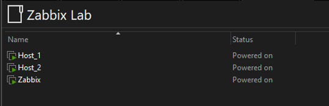
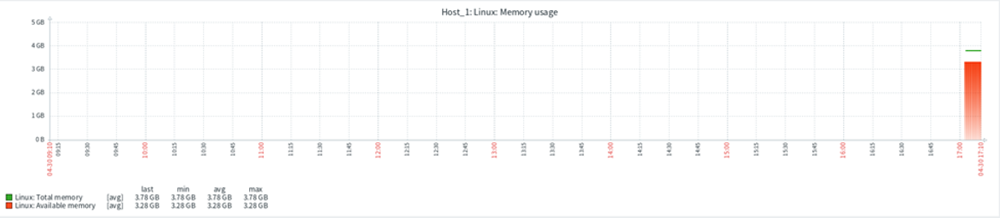
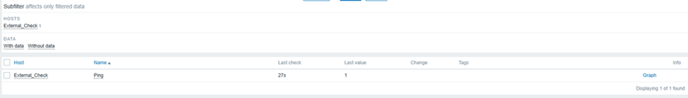
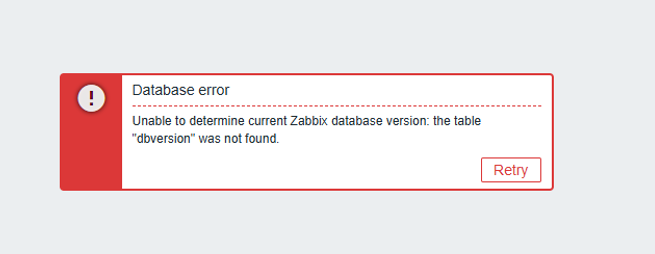

# Zabbix-Monitoring-Lab-Docker-Ubuntu

## 📌 Project Overview
This project demonstrates a monitoring lab built using Zabbix 6.4, Docker and Ubuntu VM's using VMware.

The lab includes:
- A Zabbix Server running in Docker
- Multiple Ubuntu monitored hosts
- Zabbix agents
- Trigger configuration
- ICMP ping monitoring
- Performance graphs and alerts

---

## 🏗️ Architecture
The lab was built using three virtual machines inside VMware.

### Virtual Machines
| VM | Purpose |
|---|---|
| Zabbix | Zabbix Server + Web UI |
| Host_1 | Monitored Linux host |
| Host_2 | Monitored Linux host |

---

## ⚙️ Technologies Used

- Ubuntu Server 24.04
- Docker & Docker Compose
- Zabbix 6.4
- VMware Workstation
- Linux networking
- ICMP monitoring

---

## 🚀 Deployment Steps

### 1. Install Docker
Docker and Docker Compose were installed on the Zabbix server VM.

### 2. Deploy Zabbix Containers
Zabbix server, web interface, and MariaDB containers were deployed using Docker Compose.

### 3. Install Zabbix Agents
Zabbix agents were installed on Host_1 and Host_2.

### 4. Configure Hosts
Hosts were added to the Zabbix web interface and linked with Linux templates.

### 5. Configure Monitoring
Items, triggers, and ICMP checks were configured.

---

## 📈 Performance Graphs

Zabbix collected live monitoring data from Linux hosts.

Here is an example:

---

## 🚨 Trigger Configuration

CPU usage triggers were configured to detect high resource usage.

Example trigger:
avg(/Host_1/system.cpu.util,5m)>80

---

## 🌐 Agentless Monitoring

ICMP ping monitoring was configured using simple checks.

Key used:
icmpping

This allowed Zabbix to monitor network connectivity without installing an agent.

---

## ⚠️ Troubleshooting

During deployment, several issues were encountered while configuring the Zabbix server and database containers.

Issues included:
- MariaDB compatibility problems
- Database schema errors
- Docker container restart loops

The final solution involved:
- Updating MariaDB from 10.5 to 10.6
- Using stable Zabbix 6.4 container images
- Rebuilding Docker volumes and containers

Example error:
cannot use database "zabbix":
Its "users" table is empty

An example of the error I ran into (you can check what I did by navigating to the zabbix-images folder):

---

I have also uploaded a rough PDF file so that you can see exactly what I did during this project
